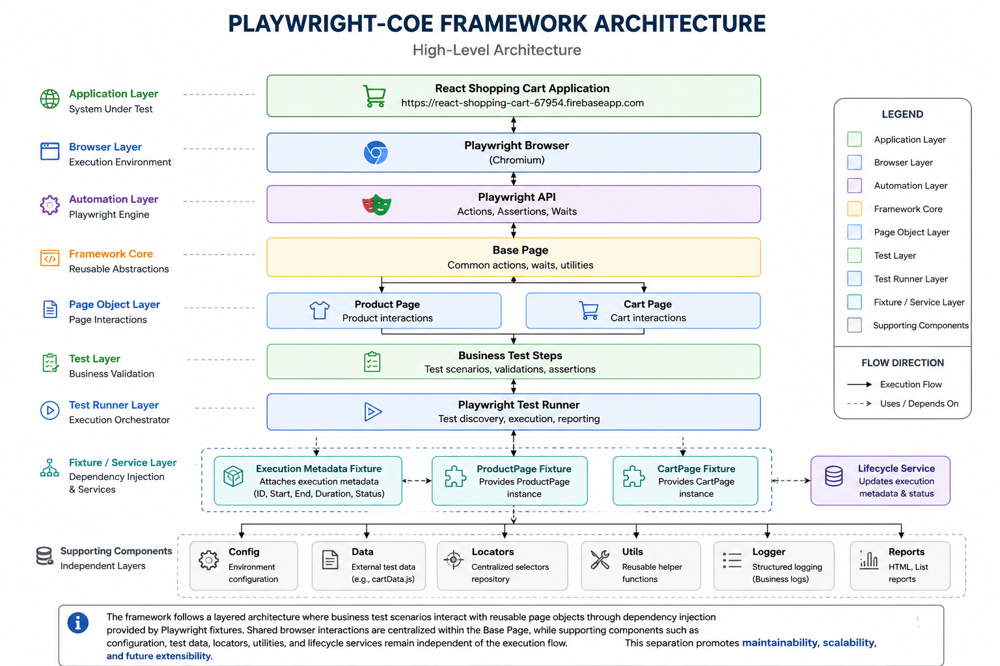

# Framework Architecture

## Objective

The objective of this framework is to provide a scalable, maintainable, and reusable automation solution for the React Shopping Cart application using Playwright and JavaScript.

The framework has been designed to separate test logic from framework infrastructure so that changes to configuration, locators, test data, reporting, or application flow can be handled with minimal impact on existing tests.

The architecture also prepares the framework for future integration with AI-assisted testing, Model Context Protocol (MCP), cloud execution, and enterprise reporting platforms.

---

## Architecture Principles

The framework has been designed following established software engineering principles to ensure long-term maintainability, scalability, and extensibility.

### Separation of Concerns

Each framework layer has a clearly defined responsibility.

Configuration, test data, locators, page objects, services, fixtures, utilities, and test scenarios are maintained independently to minimize coupling between components.

---

### Single Responsibility Principle (SRP)

Each class or module is responsible for a single purpose.

Examples include:

- Page Objects manage page interactions.
- Fixtures manage dependency injection and shared setup.
- Services manage execution lifecycle metadata.
- Utilities provide reusable helper functions.
- Tests define business validation only.

---

### Reusability

Common functionality has been centralized to eliminate duplicated code and promote reuse across multiple test scenarios.

---

### Maintainability

Framework changes can be made within individual layers without impacting unrelated components.

Examples include updating locators, configuration, or reporting independently from business test logic.

---

### Scalability

The modular architecture allows additional pages, services, fixtures, utilities, and test suites to be introduced without requiring structural changes to the framework.

---

### Extensibility

The framework has been designed to support future enhancements including AI-assisted testing, MCP integration, advanced reporting solutions, and cloud-based execution.

---

## High-Level Architecture

The framework follows a layered architecture that separates business logic from framework infrastructure. Each layer has a clearly defined responsibility, allowing the framework to remain modular, maintainable, and scalable as new applications, pages, and test scenarios are introduced.

The following diagram illustrates the high-level architecture of the framework



---

### Architecture Overview

The framework follows a layered architecture where business test scenarios interact with reusable page objects through dependency injection provided by Playwright fixtures.

Business test scenarios remain independent of browser implementation details by interacting only with the Product Page and Cart Page classes. Common browser actions such as navigation, clicking, waiting, and assertions are centralized within the Base Page to promote code reuse.

Supporting framework components including configuration, test data, locators, utilities, logging, and lifecycle services operate independently of the execution flow. This separation minimizes coupling while improving maintainability, scalability, and future extensibility.

The following sections describe each architectural layer and its responsibility within the framework.

---

## Framework Layers

The framework has been organized into multiple logical layers, each responsible for a specific aspect of automation execution.

| Layer                     | Responsibility                              |
|---------------------------|---------------------------------------------|
| Application Layer         | React Shopping Cart application under test  |
|-------------------------------------------------------------------------|
| Browser Layer             | Browser instances managed by Playwright     |
|-------------------------------------------------------------------------|
| Automation Layer          | Playwright runtime responsible for browser  | 
|                           |automation, synchronization, assertions,     | 
|                           |and execution control.                       |
|-------------------------------------------------------------------------|
| Framework Core            | Base Page centralizing common browser       |
|                           |interactions shared across all page objects. |
|-------------------------------------------------------------------------|
| Page Object Layer         | Encapsulates application-specific           |
|                           |interactions through ProductPage and         |
|                           | CartPage                                    |
|-------------------------------------------------------------------------|
| Test Layer                | Business scenarios implemented using        |
|                           | Playwright tests                            |
|-------------------------------------------------------------------------|
| Fixture & Service Layer   | Dependency injection, lifecycle management, |
|                           | execution metadata                          |
|-------------------------------------------------------------------------|
| Supporting Components     | Configuration, test data, locators,         |
|                           | utilities, logging, and reporting           |
|-------------------------------------------------------------------------|

---

## Folder Responsibilities

The framework follows a modular folder structure where each folder represents a distinct responsibility.

| Folder                | Purpose                    |
|-----------------------|----------------------------|
| config                | Environment configuration  | 
|                       | management                 |
|----------------------------------------------------|
| data                  | Externalized test data     |
|----------------------------------------------------|
| docs                  | Framework documentation    |
|----------------------------------------------------|
| fixtures              | Shared setup and           |
|                       | dependency injection       |
|----------------------------------------------------|
| locators              | Centralized UI locator     |
|                       | repository                 |
|----------------------------------------------------|
| pages                 | Page Object implementations|
|----------------------------------------------------|
| services              | Business services and      | 
|                       | lifecycle management       |
|----------------------------------------------------|
| tests                 | Business test scenarios    |
|----------------------------------------------------|
| utils                 | Reusable helper utilities  |
|----------------------------------------------------|
| .github               | Continuous Integration     |
|                       | workflow                   |
|----------------------------------------------------|

---

## Design Patterns

The framework applies multiple software design patterns to improve maintainability and scalability.

| Pattern                   | Implementation                   | Purpose              |
|---------------------------|----------------------------------|----------------------|
| Page Object Model         | ProductPage, CartPage            | Encapsulates page    |
|                           |                                  | behaviour            |
|-------------------------------------------------------------------------------------|
| Base Class Pattern        | BasePage                         | Centralizes common   |
|                           |                                  |browser actions       |
|-------------------------------------------------------------------------------------|
| Dependency Injection      | Playwright Fixtures              | Removes duplicated   |
|                           |                                  | initialization code  |
|-------------------------------------------------------------------------------------|
| Locator Repository Pattern| Locator Repository               | Centralizes          |
|                           |                                  | application locators |
|-------------------------------------------------------------------------------------|
| Service Layer             | Lifecycle Service                | Encapsulates         | 
|                           |                                  | execution metadata   |
|                           |                                  | generation           |
|-------------------------------------------------------------------------------------|

---

## Dependency Flow

The execution flow follows a top-down dependency model.

```text
Business Tests
        │
        ▼
Playwright Fixtures
        │
        ▼
Page Objects
        │
        ▼
Base Page
        │
        ▼
Playwright API
        │
        ▼
Browser
        │
        ▼
Application Under Test
```

Each layer depends only on the layer directly beneath it, minimizing coupling and improving maintainability.

---

## Scalability and Extensibility

The framework has been designed to support future enterprise requirements without requiring structural redesign.

Potential expansion areas include:

- Additional Page Objects
- Multiple Applications
- Cross-browser execution
- Multi-environment execution
- API automation
- Visual regression testing
- Accessibility testing
- AI-assisted test generation
- MCP integration
- Cloud execution

---

## Key Architectural Decisions

The following architectural decisions were intentionally made during framework development.

| Decision                          | Reason                            |
|-----------------------------------|-----------------------------------|
| Externalized Configuration        | Supports multiple execution       | 
|                                   | environments                      |
|-----------------------------------------------------------------------|
| Externalized Test Data            | Simplifies test maintenance       |
|-----------------------------------------------------------------------|
| Locator Repository                | Centralizes UI selectors          |
|-----------------------------------------------------------------------|
| Base Page                         | Eliminates duplicated browser     | 
|                                   | actions                           |
|-----------------------------------------------------------------------|
| Playwright Fixtures               | Provides dependency injection and |
|                                   | shared setup                      |
|-----------------------------------------------------------------------|
| Lifecycle Service                 | Separates execution metadata from | 
|                                   | business logic                    |
|-----------------------------------------------------------------------|
| Business Logger                   | Improves execution readability    |
|-----------------------------------------------------------------------|
| Layered Architecture              | Encourages modularity and         |
|                                   | scalability                       |
|-----------------------------------------------------------------------|

---

## Conclusion

The framework has been designed as an enterprise-grade automation solution emphasizing modularity, maintainability, scalability, and extensibility.

By combining Page Object Model, dependency injection, layered architecture, reusable services, structured reporting, and lifecycle management, the framework establishes a scalable foundation for enterprise UI automation while remaining adaptable to future AI, MCP, cloud, and advanced reporting integrations.