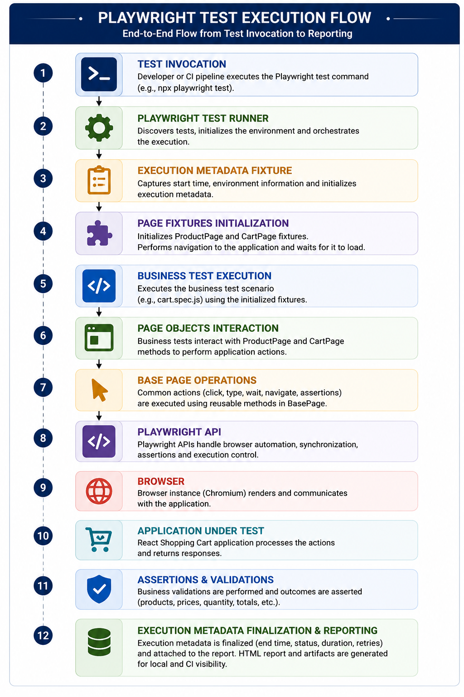
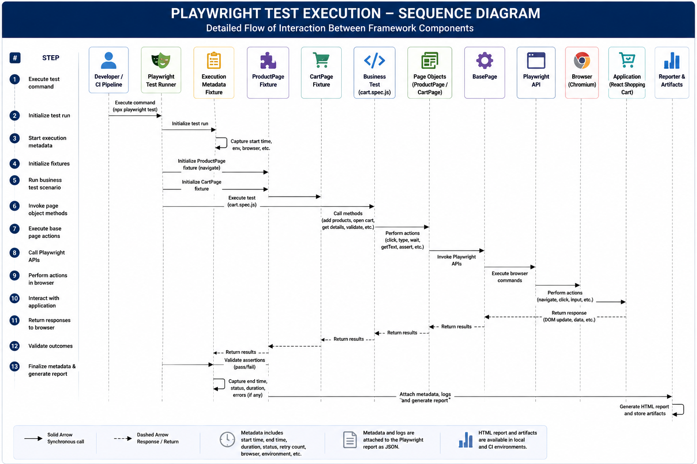

# Test Execution Flow

## Objective

This document explains how a Playwright test executes through the framework, from the initial command through fixture initialization, page-object interaction, validation, lifecycle metadata capture, reporting, and CI artifact generation.

The purpose of this flow is to demonstrate how the framework separates business test logic from setup, browser interaction, reporting, and execution lifecycle responsibilities.

---

## High-Level Execution Flow

The execution begins when a developer or CI pipeline invokes the Playwright test runner.



---

### Stage 1 – Test Invocation

Execution begins when a developer or the Continuous Integration (CI) pipeline invokes the Playwright Test Runner using one of the configured execution commands.

Typical execution commands include:

```bash
npx playwright test

npx playwright test tests/cart.spec.js

npx playwright test --grep "@smoke"
```
---

### Stage 2 – Fixture Initialization

Before any business test executes, Playwright initializes the automatic framework fixtures.

The framework currently initializes:

- `executionMetadata` fixture
- `productPage` fixture
- `cartPage` fixture

These fixtures provide dependency injection, shared setup, navigation, page initialization, and execution lifecycle management without requiring repeated setup code inside business tests.

---

### Stage 3 – Business Test Execution

Once all fixtures have been initialized, execution is transferred to the business test scenario.

Business tests contain only business validation logic and remain independent of browser initialization, configuration management, reporting, or execution lifecycle implementation.

This separation allows business scenarios to remain concise, readable, and maintainable.

---

### Stage 4 – Page Object Interaction

Business test scenarios interact exclusively with Page Objects.

The framework currently implements:

- `productPage`
- `cartPage`

These fixtures expose the corresponding Page Object classes to the business test. Each Page Object encapsulates application-specific interactions while delegating common browser operations to the `BasePage`.
---

### Stage 5 – Base Page Operations

The `BasePage` provides reusable browser functionality shared across all Page Objects.

Examples include:

- Navigation
- Click actions
- Waiting for elements
- Reading element text
- Assertions
- Browser synchronization

Centralizing these operations minimizes duplicated browser interaction code throughout the framework.

---

### Stage 6 – Validation

Business validations are executed using data collected during application interaction.

Current validations include:

- Product Names
- Product Prices
- Cart Quantity
- Grand Total
- Cart Contents

Validation logic remains isolated from browser implementation details.

---

### Stage 7 – Execution Lifecycle Completion

After business validation completes, the automatic execution metadata fixture finalizes the execution lifecycle.

Execution metadata includes:

- Start Time
- End Time
- Duration
- Browser
- Retry Count
- Execution Status
- Error Details (if applicable)

The metadata is attached automatically to the Playwright execution report as structured JSON.

---

### Stage 8 – Reporting

Execution produces multiple reporting artifacts including:

- Business Logger Output
- Playwright HTML Report
- Execution Metadata Attachments
- GitHub Actions Artifacts

These outputs provide execution visibility for both local execution and Continuous Integration pipelines.

---

## Visual Execution Overview

The following diagrams provide two complementary perspectives of framework execution.

- **High-Level Execution Flow** illustrates the complete lifecycle from test invocation through reporting.
- **Execution Sequence Diagram** illustrates how framework components collaborate and exchange control during execution.

The sequence diagram below provides a detailed view of how framework components collaborate during a single test execution.



---

## Execution Summary

The framework execution flow has been intentionally designed to separate business validation from framework infrastructure.

By delegating initialization, dependency injection, browser interaction, lifecycle management, and reporting to dedicated framework components, business test scenarios remain focused solely on application validation.

This execution model improves maintainability, scalability, readability, and future extensibility while providing a consistent execution experience across local and CI environments.